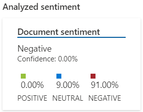
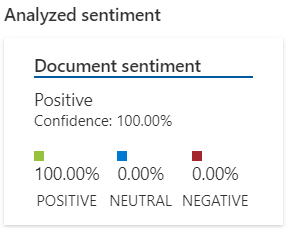
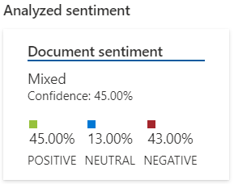

# Desafio - Análise de Sentimentos no Azure AI

## Resultados

#### Teste 1 - Sentença Negativa

"Infelizmente, minha experiência não foi nada boa. Esperei quase uma hora pelo pedido, e quando finalmente chegou, as batatas estavam frias e o lanche veio desmontado. Além disso, o refrigerante estava sem gás. Definitivamente não voltarei."

#### Teste 2 - Sentença Positiva

"A experiência foi excelente! O hambúrguer estava muito saboroso, com um pão super macio e uma carne suculenta no ponto certo. O atendimento também foi muito bom, os funcionários são atenciosos e educados. Com certeza voltarei mais vezes!"

#### Teste 3 - Sentença Neutra

"O lanche estava ok, nada muito diferente do que já comi em outros lugares. O atendimento foi normal, sem problemas, mas também sem nada que chamasse a atenção. O tempo de espera foi razoável, dentro do esperado para um horário movimentado."

