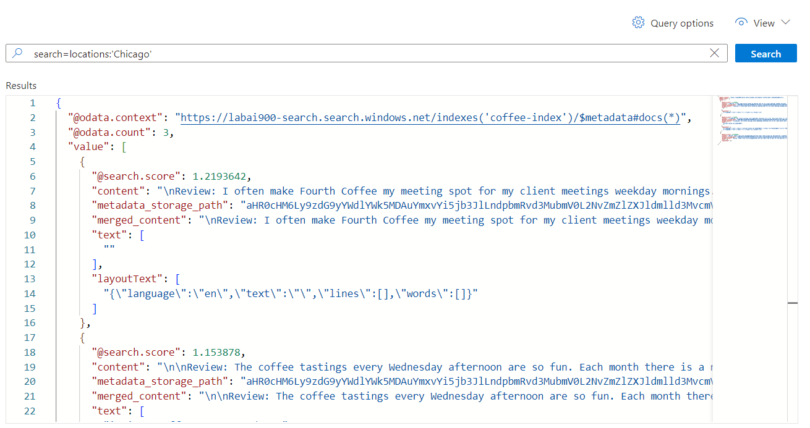
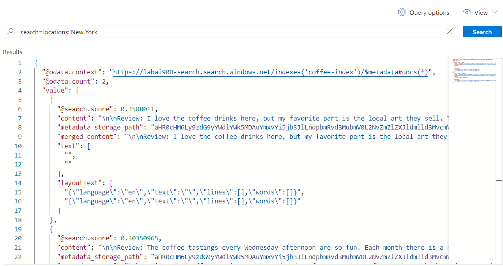

# Desafio - Azure Cognitive Search

- Descrever o passo a passo para se configurar uma pesquisa.
- [Link do tutorial](https://aka.ms/ai900-ai-search).

### 1. Criar o serviço Azure AI Search

- Acesse o [portal da plataforma](https://portal.azure.com/);
- Em "Azure AI Services", crie um "AI Search".
- Preencha os campos solicitados.

### 2. Criar Azure Service

- No menu da esquerda, clique em "Create Resource";
- Crie um Azure Service.

### 3. Criar Storage Account

- Na página inicial, procure por "Storage Account" e crie um;
- Em seguida selecione o que foi criado;
- Procure por "Configuration", habilite "Allow Blob anonymous access" e salve;
- Procure por "Containers" e crie um.

### 4. Upload e Importando data

- Dentro do container criado, clique em "Upload" e suba os arquivos baixados no [site](https://aka.ms/mslearn-coffee-reviews).

### 5. Importando dados

- No serviço AI Search criado, clique em "Importar Data" e preencha as informações solicitadas.

## Testes

#### Busca sobre "Chicago"

#### Busca sobre "New York"

